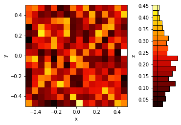
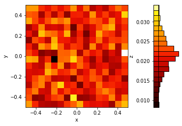

4th October 2018
================

Initial implementation of the ACDC layer, and the stacked ACDC Module. Was
unsure what to use to initialise the diagonal matrices, looking at the code
they used either an identity or uniform noise between -1 and 1. Initially,
I tried the latter.

In between layers in the stacked module, they say they use a shuffle
operation. I wasn't sure what kind of shuffle to use, so I just used a
riffle shuffle as they do in ShuffleNet, because it's simple and seems to
work in that setting. This could be a problem, because it's a systematic
transformation, rather than random and might not have as good guarantees
when mixing.

Another problem was that the input and output size of the layer has to be
equal, because there's no way for a diagonal matrix or a DCT to change the
dimensionality of the input. To get around this, I use a Linear layer to
create new dimensions, then concatenate them on to the end. When reducing
dimensionality I use a Linear layer to create a residual of the desired
size from the "extra" dimensions, then add this to the remaining dimensions
after dropping the "extra" ones.

Finally, the FFT is much faster if the input is always a power of 2, so I
added a provision to group the input into powers of 2 before the DCT, so
the DCT is always acting on a power of 2.

To check it can learn something useful, ran it on MNIST, with the default
settings for the PyTorch MNIST example, using the following model
definition:

```
class Net(nn.Module):
    def __init__(self):
        super(Net, self).__init__()
        self.acdc = StackedACDC(784, 64, 12, groups=8)
        self.fc2 = nn.Linear(64, 10)

    def forward(self, x):
        n, c, h, w = x.size()
        x = x.view(n, c*h*w)
        x = F.relu(self.acdc(x))
        x = self.fc2(x)
        return F.log_softmax(x, dim=1)
```

It maps down to the output dimensionality in the 12 steps. It was able to
classify a bit, but it has a final linear layer, which can count for a lot
in MNIST.

```
Test set: Average loss: 0.1120, Accuracy: 9657/10000 (97%)
```

Then, after reading the right section of the paper I realised that the
initialisation I was using was wrong, so I changed it to the recommendation
of the paper, which is diagonal normal mean=1 sigma=10^-2. Unfortunately,
that trained a little worse:

```
Test set: Average loss: 0.3903, Accuracy: 9518/10000 (95%)
```

Training appears to be relatively slow. It's a few times slower than the
ConvNet default that comes with the MNIST example. Also, there is *no
regularisation* in this model and yet it does not overfit, which is not a
good thing.

Removing the final Linear layer, and deactivating those used when we drop
dimensions, tried to train the resulting model on MNIST. I wouldn't expect
it to work well necessarily, but it might work a bit. It barely worked:

```
Test set: Average loss: 1.6744, Accuracy: 5541/10000 (55%)
```

It doesn't seem like it is a very easy model component to optimise. That's
partly what we might expect from Figure 3 in the paper.

Finally, I thought the execution speed seemed too slow even for the
multiple layers. Added a line to the testing in `layers.py` to look at the
execution time compared to a `Linear` layer. According to Figure 2 in the
paper, the ACDC layer should be significantly faster with an input
dimensionality of 4096. 100 loops with the packing and unpacking disabled:

```
Linear:  0.007770444266498089
ACDC:  0.5301398802548647
```

Then with packing and unpacking enabled:

```
Linear:  0.005231818184256554
ACDC:  0.529364119283855
```

Must be an issue with the DCT implementation.

Added speed test to the `_dct.py` file:

```
dct1:  0.01097189262509346
dct:  0.2719538463279605
idct:  0.1428453316912055
Linear:  0.00483915489166975
```

So, on the GPU it's slower than a Linear layer every time. The forward DCT
being the worst. Looking at the implementation there's a lot of wacky stuff
going on around the calls to the actual FFT function, which could be
causing the problems, especially given that stuff's not present in `dct1`,
which is much faster (though still slower than Linear).

On CPU, the DCTs are faster than a Linear layer, so it could be that the
CUDA FFT is not optimized well (unlikely), or that something else is
slowing it down:

```
CPU Speed (100 executions):
  dct1:  1.1211627703160048
  dct:  2.0362922428175807
  idct:  3.8709053453058004
  Linear:  4.468587472103536
GPU speed (100 executions):
  dct1:  0.010546403005719185
  dct:  0.2743651457130909
  idct:  0.14596352353692055
  Linear:  0.004489514045417309
```

To check if this is the same in tensorflow, ran the DCT that comes with
tensorflow (running on GPU):

```
DCT:  0.6155939232558012
Linear:  0.9840689264237881
```

This one is faster than the linear layer, but the linear layer is so much
slower than the linear layer in PyTorch. I implemented it as just a matrix
multiply with a random normal weight matrix.

5th October 2018
================

Added a test of the linear problem from Section 6.1 of the paper. This
implementation isn't able to get the loss below 1.0 after 1000 iterations,
and the iterations themselves are extremely slow. 

Trying to figure out why the DCT implementation is so much slower than a
linear layer ended up messing around with the code for the DCT. The FFT on
its own is actually faster than the linear layer (just) on the GPU and CPU,
which is nice.

Thought that it was the generation of `torch.arange` in every pass that
would be increasing the time, so decided to cached that part, as we only
have to know the size of the incoming X. Made a module, and called it
`FasterDCT` to do this. Unfortunately, that didn't affect the speed at all.
Found that the major factor affecting the speed was the `.flip(1)` on the
array before the FFT.

It turned out it was actually faster to use the form of the DCT by DFT
where we just pad the input with zeros using the (relatively efficient) pad
operations built into pytorch. Doing this and the result was slower on the
CPU, but about 10 times faster on the GPU.

Unfortunately, this is still slower than the Linear layer, so finally wrote
an implementation that *is a linear layer*. It's just a linear layer where
the weights are the DCT matrix. This seems to work fine. On the GPU, it's
actually the same speed as the `rfft`:

```
CPU Speed (100 executions):
  dct1:  1.0706987995654345
  dct:  1.982983972877264
  idct:  3.213463810272515
  rfft:  0.631943185813725
  FasterDCT:  3.719810419715941
  Linear:  4.693692773580551
GPU speed (100 executions):
  dct1:  0.010924047790467739
  dct:  0.27390200551599264
  idct:  0.14248866774141788
  rfft:  0.004178566858172417
  FasterDCT:  0.030473709106445312
  Linear:  0.006033767946064472
  Dense DCT:  0.004221102222800255
```

6th October 2018
================

Realised that if I'm implementing the DCT as a linear layer I can just
parameterise the whole ACDC layer (and potentially the entire stack) as a
single Linear layer as well, thanks to the associativity of matrix
multiplication. We still have to multiply together the different
components, but on a GPU this can be done in parallel, before the examples
propagate to that layer. Also, since this uses simple Linear layers, it'll
probably run much easier in this deep learning framework.

Wrote an ACDC linear layer and validated the output. It matches the ACDC
layer already written.

Wrote a poorly named script `acdc.py` that passes an identity matrix
through the stacked ACDC layer to estimate the effective weight matrix for
multiple layers. Got these results with 16 layers, after removing the
batchnorm and relus from the stacked implementation.

```
Input dim 4
  Glorot stdv is 0.5
  Effective W stdv 1.0834022760391235
  Effective W mean 0.03615774214267731
Input dim 8
  Glorot stdv is 0.35355339059327373
  Effective W stdv 0.6777600646018982
  Effective W mean 0.20750541985034943
Input dim 16
  Glorot stdv is 0.25
  Effective W stdv 0.6487581133842468
  Effective W mean 0.08766232430934906
Input dim 32
  Glorot stdv is 0.17677669529663687
  Effective W stdv 0.429548442363739
  Effective W mean -0.01238858513534069
Input dim 64
  Glorot stdv is 0.125
  Effective W stdv 0.3179543614387512
  Effective W mean 0.044064365327358246
Input dim 128
  Glorot stdv is 0.08838834764831843
  Effective W stdv 0.22509363293647766
  Effective W mean 0.005937715992331505
Input dim 256
  Glorot stdv is 0.0625
  Effective W stdv 0.1555483341217041
  Effective W mean 0.0009372985805384815
```

But, we really would like to know the effect of having more layers as well,
so this will probably be something we have to graph. Hopefully then it will
be clearer what is necessary to make the initialisation closer to standard
initialisations, which is very important for optimisation.

Tried a stacked version of this linear ACDC layer using a real permutation
instead of the riffle shuffle we were using before and it was able to
perform the linear layer approximation. Not sure how good the result is,
but the final loss was `0.0198`.

I have also removed the batch norm and changed the optimiser for to Adam,
so I thought it was also worth checking if the riffle shuffle would
actually also work. Putting that in and the final loss after 1000
iterations was `0.0208`, so about the same. It ran several times faster as
well.

Tried it out on MNIST and it optimises to 97% with *no fully connected
layers*. I just flatten the image and propagate it through 32 ACDC layers,
then throw away all but 10 dimensions of the output.

```
Test set: Average loss: 0.0952, Accuracy: 9741/10000 (97%)
```

Replaced the 1 by 1 convolutions in a resnet18 and ran this on CIFAR-10.
Unfortunately, it wasn't able to get more than 82% on the test set; 89% on
the training set after around 40 epochs.

The implementation of a 1 by 1 convolution I used is much slower than a
real implementation. It involves rearranging the dimensions of the tensor
to express it as a linear layer. The layer would be much faster if the
weights for the 1 by 1 convolution were just replaced and then the forward
prop worked the same way. Also, would provide an easy way to define other
sizes of convolution.

Unfortunately, there's no reason to expect that that might converge better,
so it still isn't likely that it'll converge on CIFAR-10.

As a final data point, with only a single ACDC layer instead of a stack,
the ResNet18 overfits on CIFAR-10. Gets 90% on train, but only 85% on test
after 50 epochs.

8th October 2018
================

Investigated the statistics of the weight matrices more in a notebook.
Found that the matrices learnt are not much like the random matrices we
normally use. The mean is non-zero on the diagonal, close to 1, and the
variance can be much greater than 1./sqrt(dim) - especially as the
dimension grows. Full notebook is
[here](https://gist.github.com/gngdb/82407cf7ab747a96e9a60eacbe1611cd).

After making this notebook, I wondered if putting a riffle shuffle in
between the forward and inverse DCT might help to get closer to a "better"
initialisation. After doing this, the mean loses it's unit diagonal, and
the standard deviation becomes much more uniform. 

Here's an example mean:



And example standard deviation:



While the standard deviation is a bit lower than "standard"
initialisations, this is much closer to the properties we want in an
initialisation.

So, I ran the experiment on CIFAR-10 again. Before, neither training nor
test would get above 90%. After, the model learns a lot more like the
standard model: 99% on train, 92% on test after 70+ epochs.

Of course, this doesn't mean that this actually works, because I've only
replaced the 1 by 1 in shortcut connections, so only a few layers in the
ResNet.
