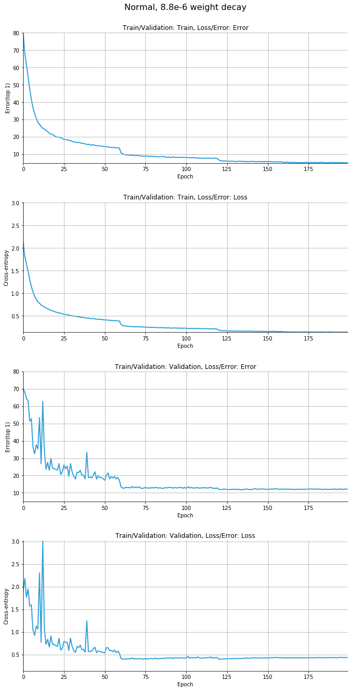
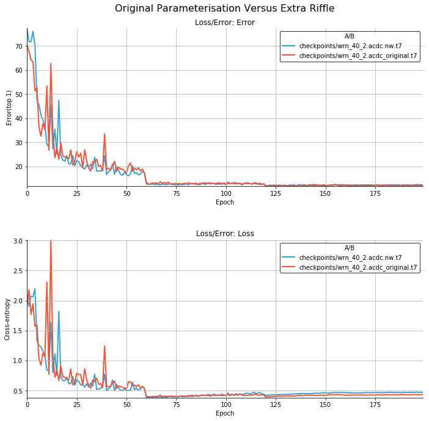
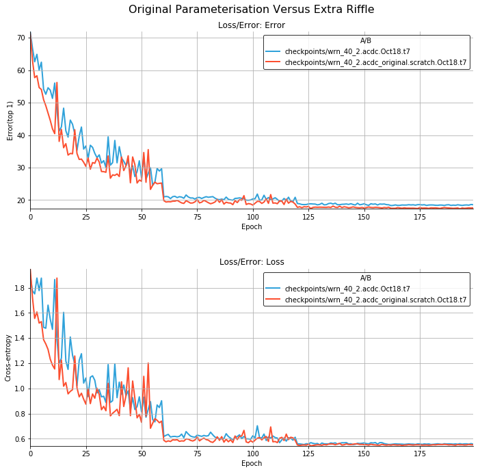

4th October 2018
================

Initial implementation of the ACDC layer, and the stacked ACDC Module. Was
unsure what to use to initialise the diagonal matrices, looking at the code
they used either an identity or uniform noise between -1 and 1. Initially,
I tried the latter.

In between layers in the stacked module, they say they use a shuffle
operation. I wasn't sure what kind of shuffle to use, so I just used a
riffle shuffle as they do in ShuffleNet, because it's simple and seems to
work in that setting. This could be a problem, because it's a systematic
transformation, rather than random and might not have as good guarantees
when mixing.

Another problem was that the input and output size of the layer has to be
equal, because there's no way for a diagonal matrix or a DCT to change the
dimensionality of the input. To get around this, I use a Linear layer to
create new dimensions, then concatenate them on to the end. When reducing
dimensionality I use a Linear layer to create a residual of the desired
size from the "extra" dimensions, then add this to the remaining dimensions
after dropping the "extra" ones.

Finally, the FFT is much faster if the input is always a power of 2, so I
added a provision to group the input into powers of 2 before the DCT, so
the DCT is always acting on a power of 2.

To check it can learn something useful, ran it on MNIST, with the default
settings for the PyTorch MNIST example, using the following model
definition:

```
class Net(nn.Module):
    def __init__(self):
        super(Net, self).__init__()
        self.acdc = StackedACDC(784, 64, 12, groups=8)
        self.fc2 = nn.Linear(64, 10)

    def forward(self, x):
        n, c, h, w = x.size()
        x = x.view(n, c*h*w)
        x = F.relu(self.acdc(x))
        x = self.fc2(x)
        return F.log_softmax(x, dim=1)
```

It maps down to the output dimensionality in the 12 steps. It was able to
classify a bit, but it has a final linear layer, which can count for a lot
in MNIST.

```
Test set: Average loss: 0.1120, Accuracy: 9657/10000 (97%)
```

Then, after reading the right section of the paper I realised that the
initialisation I was using was wrong, so I changed it to the recommendation
of the paper, which is diagonal normal mean=1 sigma=10^-2. Unfortunately,
that trained a little worse:

```
Test set: Average loss: 0.3903, Accuracy: 9518/10000 (95%)
```

Training appears to be relatively slow. It's a few times slower than the
ConvNet default that comes with the MNIST example. Also, there is *no
regularisation* in this model and yet it does not overfit, which is not a
good thing.

Removing the final Linear layer, and deactivating those used when we drop
dimensions, tried to train the resulting model on MNIST. I wouldn't expect
it to work well necessarily, but it might work a bit. It barely worked:

```
Test set: Average loss: 1.6744, Accuracy: 5541/10000 (55%)
```

It doesn't seem like it is a very easy model component to optimise. That's
partly what we might expect from Figure 3 in the paper.

Finally, I thought the execution speed seemed too slow even for the
multiple layers. Added a line to the testing in `layers.py` to look at the
execution time compared to a `Linear` layer. According to Figure 2 in the
paper, the ACDC layer should be significantly faster with an input
dimensionality of 4096. 100 loops with the packing and unpacking disabled:

```
Linear:  0.007770444266498089
ACDC:  0.5301398802548647
```

Then with packing and unpacking enabled:

```
Linear:  0.005231818184256554
ACDC:  0.529364119283855
```

Must be an issue with the DCT implementation.

Added speed test to the `_dct.py` file:

```
dct1:  0.01097189262509346
dct:  0.2719538463279605
idct:  0.1428453316912055
Linear:  0.00483915489166975
```

So, on the GPU it's slower than a Linear layer every time. The forward DCT
being the worst. Looking at the implementation there's a lot of wacky stuff
going on around the calls to the actual FFT function, which could be
causing the problems, especially given that stuff's not present in `dct1`,
which is much faster (though still slower than Linear).

On CPU, the DCTs are faster than a Linear layer, so it could be that the
CUDA FFT is not optimized well (unlikely), or that something else is
slowing it down:

```
CPU Speed (100 executions):
  dct1:  1.1211627703160048
  dct:  2.0362922428175807
  idct:  3.8709053453058004
  Linear:  4.468587472103536
GPU speed (100 executions):
  dct1:  0.010546403005719185
  dct:  0.2743651457130909
  idct:  0.14596352353692055
  Linear:  0.004489514045417309
```

To check if this is the same in tensorflow, ran the DCT that comes with
tensorflow (running on GPU):

```
DCT:  0.6155939232558012
Linear:  0.9840689264237881
```

This one is faster than the linear layer, but the linear layer is so much
slower than the linear layer in PyTorch. I implemented it as just a matrix
multiply with a random normal weight matrix.

5th October 2018
================

Added a test of the linear problem from Section 6.1 of the paper. This
implementation isn't able to get the loss below 1.0 after 1000 iterations,
and the iterations themselves are extremely slow. 

Trying to figure out why the DCT implementation is so much slower than a
linear layer ended up messing around with the code for the DCT. The FFT on
its own is actually faster than the linear layer (just) on the GPU and CPU,
which is nice.

Thought that it was the generation of `torch.arange` in every pass that
would be increasing the time, so decided to cached that part, as we only
have to know the size of the incoming X. Made a module, and called it
`FasterDCT` to do this. Unfortunately, that didn't affect the speed at all.
Found that the major factor affecting the speed was the `.flip(1)` on the
array before the FFT.

It turned out it was actually faster to use the form of the DCT by DFT
where we just pad the input with zeros using the (relatively efficient) pad
operations built into pytorch. Doing this and the result was slower on the
CPU, but about 10 times faster on the GPU.

Unfortunately, this is still slower than the Linear layer, so finally wrote
an implementation that *is a linear layer*. It's just a linear layer where
the weights are the DCT matrix. This seems to work fine. On the GPU, it's
actually the same speed as the `rfft`:

```
CPU Speed (100 executions):
  dct1:  1.0706987995654345
  dct:  1.982983972877264
  idct:  3.213463810272515
  rfft:  0.631943185813725
  FasterDCT:  3.719810419715941
  Linear:  4.693692773580551
GPU speed (100 executions):
  dct1:  0.010924047790467739
  dct:  0.27390200551599264
  idct:  0.14248866774141788
  rfft:  0.004178566858172417
  FasterDCT:  0.030473709106445312
  Linear:  0.006033767946064472
  Dense DCT:  0.004221102222800255
```

6th October 2018
================

Realised that if I'm implementing the DCT as a linear layer I can just
parameterise the whole ACDC layer (and potentially the entire stack) as a
single Linear layer as well, thanks to the associativity of matrix
multiplication. We still have to multiply together the different
components, but on a GPU this can be done in parallel, before the examples
propagate to that layer. Also, since this uses simple Linear layers, it'll
probably run much easier in this deep learning framework.

Wrote an ACDC linear layer and validated the output. It matches the ACDC
layer already written.

Wrote a poorly named script `acdc.py` that passes an identity matrix
through the stacked ACDC layer to estimate the effective weight matrix for
multiple layers. Got these results with 16 layers, after removing the
batchnorm and relus from the stacked implementation.

```
Input dim 4
  Glorot stdv is 0.5
  Effective W stdv 1.0834022760391235
  Effective W mean 0.03615774214267731
Input dim 8
  Glorot stdv is 0.35355339059327373
  Effective W stdv 0.6777600646018982
  Effective W mean 0.20750541985034943
Input dim 16
  Glorot stdv is 0.25
  Effective W stdv 0.6487581133842468
  Effective W mean 0.08766232430934906
Input dim 32
  Glorot stdv is 0.17677669529663687
  Effective W stdv 0.429548442363739
  Effective W mean -0.01238858513534069
Input dim 64
  Glorot stdv is 0.125
  Effective W stdv 0.3179543614387512
  Effective W mean 0.044064365327358246
Input dim 128
  Glorot stdv is 0.08838834764831843
  Effective W stdv 0.22509363293647766
  Effective W mean 0.005937715992331505
Input dim 256
  Glorot stdv is 0.0625
  Effective W stdv 0.1555483341217041
  Effective W mean 0.0009372985805384815
```

But, we really would like to know the effect of having more layers as well,
so this will probably be something we have to graph. Hopefully then it will
be clearer what is necessary to make the initialisation closer to standard
initialisations, which is very important for optimisation.

Tried a stacked version of this linear ACDC layer using a real permutation
instead of the riffle shuffle we were using before and it was able to
perform the linear layer approximation. Not sure how good the result is,
but the final loss was `0.0198`.

I have also removed the batch norm and changed the optimiser for to Adam,
so I thought it was also worth checking if the riffle shuffle would
actually also work. Putting that in and the final loss after 1000
iterations was `0.0208`, so about the same. It ran several times faster as
well.

Tried it out on MNIST and it optimises to 97% with *no fully connected
layers*. I just flatten the image and propagate it through 32 ACDC layers,
then throw away all but 10 dimensions of the output.

```
Test set: Average loss: 0.0952, Accuracy: 9741/10000 (97%)
```

Replaced the 1 by 1 convolutions in a resnet18 and ran this on CIFAR-10.
Unfortunately, it wasn't able to get more than 82% on the test set; 89% on
the training set after around 40 epochs.

The implementation of a 1 by 1 convolution I used is much slower than a
real implementation. It involves rearranging the dimensions of the tensor
to express it as a linear layer. The layer would be much faster if the
weights for the 1 by 1 convolution were just replaced and then the forward
prop worked the same way. Also, would provide an easy way to define other
sizes of convolution.

Unfortunately, there's no reason to expect that that might converge better,
so it still isn't likely that it'll converge on CIFAR-10.

As a final data point, with only a single ACDC layer instead of a stack,
the ResNet18 overfits on CIFAR-10. Gets 90% on train, but only 85% on test
after 50 epochs.

8th October 2018
================

Investigated the statistics of the weight matrices more in a notebook.
Found that the matrices learnt are not much like the random matrices we
normally use. The mean is non-zero on the diagonal, close to 1, and the
variance can be much greater than 1./sqrt(dim) - especially as the
dimension grows. Full notebook is
[here](https://gist.github.com/gngdb/82407cf7ab747a96e9a60eacbe1611cd).

After making this notebook, I wondered if putting a riffle shuffle in
between the forward and inverse DCT might help to get closer to a "better"
initialisation. After doing this, the mean loses it's unit diagonal, and
the standard deviation becomes much more uniform. 

Here's an example mean:


And example standard deviation:


While the standard deviation is a bit lower than "standard"
initialisations, this is much closer to the properties we want in an
initialisation.

So, I ran the experiment on CIFAR-10 again. Before, neither training nor
test would get above 90%. After, the model learns a lot more like the
standard model: 99% on train, 92% on test after 70+ epochs.

Of course, this doesn't mean that this actually works, because I've only
replaced the 1 by 1 in shortcut connections, so only a few layers in the
ResNet.

9th October 2018
================

Replaced most of the convolutions in a ResNet18 and tried to train on
CIFAR-10 with the default settings. Used [kuangliu's repo as a
base](su://github.com/kuangliu/pytorch-cifar). Unfortunately, even after 79
epochs it hadn't cleared 70% on the test set. An unconstrained ResNet18
would be getting about 91% on test at this point.

```
Epoch: 79
 [============================ 391/391 ===========================>]  Step: 312ms | Tot: 2m41s | Loss: 0.473 | Acc: 83.334% (41667/50000 
 [============================ 100/100 ===========================>]  Step: 126ms | Tot: 12s749ms | Loss: 0.985 | Acc: 69.810% (6981/100
```

It seems like training on constrained weight matrices is always going to be
difficult, as you're playing with the optimization dynamics of neural
networks, which are not well understood.

As probably the last thing I'll do on this project, I implemented a stacked
ACDC layer than combines all of the matrices used in a stacked ACDC layer
before performing a convolution using that as weights. This should be
faster, because in most cases the effective weight matrices are smaller
than the batch size. The way it's implemented could be faster, I just call
`reduce` to combine them, but the combination could be parallelised using
`cat` and slicing. That's too much.

It's about twice as fast on the test input, so not much better.

```
StackedConvACDC:  0.35135913360863924
FastStackedConvACDC:  0.21031779795885086
```

12th October 2018
=================

Tried running a ResNet50 replacing all the convolutions with 12 layers of
ACDC convolutions. Perhaps unsurprisingly, this maxes out the memory on the
GPUs.

13th October 2018
=================

To get an estimate what kind of performance we should expect of a network
trained using an ACDC convolutional layer, wanted to take a closer look at
exactly how many FLOPs and parameters are used by different networks. Using
a script left over from the moonshine work (with some modifications):

**This is wrong, see below.**

```
Tiny ConvNet    FLOPS           params
  Original:     1.83065E+07     8.96740E+04
  ACDC:         2.18184E+05     9.03400E+03
ResNet18        FLOPS           params
  Original:     5.55423E+08     1.11740E+07
  ACDC:         4.14427E+06     1.20650E+05
WRN(40,2)       FLOPS           params
  Original:     3.28304E+08     2.24355E+06
  ACDC:         3.78971E+06     7.70180E+04
```

On every network the reduction in FLOPs is between 1 and 2 orders of
magnitude. On the smallest network the reduction in parameters is only
about 10 times, but for the others it's more. For a ResNet18, it only uses
about 1/100 the parameters. So, it's hardly surprising that we aren't able
to train it to the same accuracy after replacing the convolutions.

16th October 2018
=================

Tried training a wide resnet using Moonshine, replacing all the
convolutions with ACDC convolutions. Initially, this did not work at all.
Training from scratch without a teacher network:

```
Error@1 34.660 Error@5 3.090
```

However, learning from an experiment running Hyperband over a tiny
convolutional network, I found that changing the weight decay factor to
`8.8e-6` made a huge difference:

```
Error@1 8.760 Error@5 0.260
```

Full results and learning curves are illustrated in [this
notebook](https://gist.github.com/gngdb/3dec734700895f0580cbc780abdd0e6c).

**Error in above FLOP calculations**. Was not taking into account the
number of times the ACDC layers would be applied in a convolutional ACDC
layer. Fixing this, and I found that the Mult-Adds were *much* less
competitive:

```
Tiny ConvNet   FLOPS          params
  Original:    1.83065E+07    8.96740E+04
  ACDC:        2.94185E+07    9.03400E+03
ResNet18       FLOPS          params
  Original:    5.55423E+08    1.11740E+07
  ACDC:        2.31831E+08    1.20650E+05
WRN(40,2)      FLOPS          params
  Original:    3.28304E+08    2.24355E+06
  ACDC:        2.43861E+08    7.70180E+04
```

Looking into it, it turns out in the early layers where the number of
channels is small the effective dimensionality of the ACDC layer is not
enough to make a sequence of 12 ACDC layers worthwhile.

But, thinking about that, it's easy to tell where this is going to be the
case, and in those cases where it would be faster to simply use the weight
matrix parameterised (as we do at training time) in the test time
implementation. Doing this, we get a much more reasonable result (although
not quite so good as the false results above):

```
Tiny ConvNet    FLOPS        params
  Original:    1.83065E+07    8.96740E+04
  ACDC:        2.76143E+06    1.83400E+03
ResNet18    FLOPS        params
  Original:    5.55423E+08    1.11740E+07
  ACDC:        2.26888E+07    2.59300E+04
WRN(40,2)    FLOPS        params
  Original:    3.28304E+08    2.24355E+06
  ACDC:        2.46428E+07    2.32580E+04
```

17th October 2018
=================

For the paper, wanted to write about the MNIST and linear approximation
results. So ran the MNIST experiment again with our parameterisation of the
LinearACDC layer. After 10 epochs, both with and without the extra riffle
shuffle, if the Adam optimizer is used it converges fine to 97%.

Ah, just went back and read this research log, and it was only on CIFAR
experiments that the initialisation really matters.

18th October 2018
=================

Ran the experiment with moonshine again after editing the code to use the
original ACDC parameterisation, without the extra riffle shuffle. The
results are strange. Without attention transfer, ie training without a
teacher on its own, the network converges to a very similar final loss:

```
Error@1 12.020 Error@5 0.410
```

*But*, when trying to distil from the student network, it fails to learn
even that well:

```
Error@1 13.400 Error@5 0.760
```

The settings are all the same, as far as I know.

When I made the change to using the extra riffle shuffle I was
experimenting with ResNet18, trying to train it from scratch, and that was
where I found it helped. These results are with WideResNets, so it could
just be an architecture difference. It does suggest that there is some
capacity difference between the two parameterisations. But, the fact that
it trains the same when not using distillation is concerning.

Looking at the learning curves:




Directly comparing the validation errors and losses to using the extra
riffle shuffle, again we only see a difference when training with attention
transfer:




Notebook generating these results can be found
[here](https://gist.github.com/gngdb/723ff595209f2e76d5e3aea7a7a8e1e0).

While checking the kernel matrix parameterisation, I realised that what
was currently implemented *could not* be implemented as a DCT, because the
matrix is reshaped in the wrong way. So, what we have is still an effective
low-rank matrix approximation, but our claims about efficient test time
implementations are undermined.

To fix this, it's more complicated than just reshaping a different way. I
failed to realise before that because the kernel matrix *must be square*
and the input dimensions *must be `c_in*k*k`*, then the number of output
channels must be `c_out*k*k`. So, the matrices are very large. Luckily, we
only scale with `n log(n)`.

There's one way to deal with this problem. Almost all filters that are not
1x1 are 3x3, so the scaling will be limited to a factor of 9. By
coincidence, *we are already applying a larger scaling factor*, by stacking
ACDC layers in groups of 12. So, we can just stack *fewer* layers, and
collapse those that are remaining. That will control the growth in
parameters, but in this case, we have issues with the memory expansion of
that many channels in the activations before the contraction occurs, so we
might end up having to use `checkpoint`s.

19th October 2018
=================

After updating the code to fix the parameterisation problem described
yesterday, ran the moonshine experiments again. Unfortunately, it didn't
get the same promising results. None of the experiments were able to get
past 90% accuracy.




In addition, the original ACDC parameterisation performed better than the
parameterisation without the riffle shuffle.

This is a bit strange, because the low-rank parameterisation *did work*, it
just couldn't be implemented using DCTs at test time. So, we have a
low-rank parameterisation that can be trained to quite good performance
using attention transfer.

It seems likely that the hack to reduce parameter growth when using massive
kernel matrices (using less ACDC layers) is probably the culprit here.
Given that, we need to go back to using square kernel matrices, but the
only convolutions that can trivially have square kernel matrices are 1x1
convolutions.

One way we can make all convolutions in the network 1x1 is to make any that
aren't 1x1 *separable* by preceding them with a 3x3 grouped convolution.
Separable convolutions work well with full-rank matrices, so this seems
like it might work well.

Unfortunately, that would mean we aren't training networks constrained to
be fully low-rank, unless the grouped convolutions were also made from ACDC
layers, but that's going to take more development. To begin with, it's
worth trying with full-rank 3x3 convolutions.

Now running an experiment with full rank 3x3 grouped convolutions and
another with low-rank 3x3 grouped convolutions.

Preliminary result: full rank grouped convolutions and 1x1 ACDC layers
works well; reaching the same 91.5% accuracy after 150 epochs. Having the
extra riffle shuffle seems to be marginally better, but the difference may
not be significant.

22nd October 2018
=================

Paper about this is now submitted to the [CDNNRIA Workshop][cdnnria] at
NIPS.

Had to fix the parameter counts. A few layers were being ignored by the
flaky recursive function. I didn't figure out exactly why that was
happening. Instead I just rewrote it so I did understand what it was doing.

Unfortunately, I then realised that there were a few convolutional layers
remaining in the network not implemented using the ACDC parameterisation. I
then replaced these and ran the experiment again, using only the original
ACDC parameterisation.

With full rank 3x3 convolutions, the parameter cost is then:

```
WRN(40,2)   FLOPS       params
  Original: 3.28304E+08 2.24355E+06
  ACDC:     3.32076E+07 4.64420E+04
```

Without, it is:

```
WRN(40,2)   FLOPS       params
  Original: 3.28304E+08 2.24355E+06
  ACDC:     3.32076E+07 3.87140E+04
```

So, as expected, not much different. The final performance was a little
worse, consistent with what we'd seen before; approximating the first layer
is generally bad. Top 1 test error:

```
             full rank 3x3         ACDC 3x3
Scratch:     10.64%                13.46%
Distilled:   10.13%                14.07%
```

Replacing the first convolution with a separable ACDC convolution appears
to affect performance a lot. Strangely, meaning that the distillation
doesn't even work. The 3x3 ACDC approximation doesn't save many parameters
and costs quite a lot. Also, it seems like it's a bad idea to
replace the first layer with anything compresed.

More development needed to figure out how best to run a network with
entirely a structured efficient transform; maybe slightly different network
structures would work. What we're doing here, subsituting into an existing
network, is just the easiest thing to do.

[cdnnria]: https://openreview.net/group?id=NIPS.cc/2018/Workshop/CDNNRIA

5th November 2018
=================

Wrote a [wrapper for scipy's
minimize](https://gist.github.com/gngdb/a9f912df362a85b37c730154ef3c294b).
What I would like to do is characterise a set of layers for approximating
random matrices, and compare them in terms of how well the approximation of
a random matrix is, versus the number of parameters they use. To start
with, here is the relationship between number of layers and the final error
for a stacked ACDC layer.

```
2 layers:  0.029214851558208466
4 layers:  0.029352974146604538
8 layers:  0.027544179931282997
16 layers:  0.024741271510720253
32 layers:  0.02224716544151306
```

It would be interesting to compare this against:

* ShuffleNet's grouped riffle shuffle computations.
* AFDF layers
* Block-diagonal ACDC layers
* Block-diagonal AFDF layers

Hopefully we'll see something interesting with the ability of fourier of
cosine basis functions in approximating random matrices; ie that they
should be better than just a shuffled sequence of block diagonal matrices.
But, I don't know how far the fourier theory from the ACDC paper will take
us here. Also, I don't know if this is a good metric to compare theses
things: because what we care about is how well these layers will work when
placed in a convolutional network, and the layers that depart more
from the accepted norms are harder to trust.

6th November 2018
=================

Results with random permutations in the ACDC layers:

```
ACDC_1 with 64 parameters: 0.039945361018180844 +/- 0.005887363463677418
ACDC_2 with 128 parameters: 0.02196877747774124 +/- 0.0013313392086725547
ACDC_4 with 256 parameters: 0.016572200693190098 +/- 0.0012870614529237553
ACDC_8 with 512 parameters: 0.012996809277683496 +/- 0.0012446588624042596
ACDC_16 with 1024 parameters: 0.011954690515995025 +/- 0.0024686511387117167
ACDC_32 with 2048 parameters: 0.009839443862438202 +/- 0.0015687459345148055
```

Results with riffle shuffles:

```
ACDC_1 with 64 parameters: 0.03738211020827294 +/- 0.0022882278375070462
ACDC_2 with 128 parameters: 0.022296894714236258 +/- 0.0009171796806360699
ACDC_4 with 256 parameters: 0.01644732430577278 +/- 0.0011384906728047184
ACDC_8 with 512 parameters: 0.015047317650169135 +/- 0.002108139076455881
ACDC_16 with 1024 parameters: 0.014236731920391321 +/- 0.0014999212816127136
ACDC_32 with 2048 parameters: 0.01347635304555297 +/- 0.00204254258469781
```

With no shuffle at all:

```
ACDC_1 with 64 parameters: 0.042672832310199735 +/- 0.003499810547424213
ACDC_2 with 128 parameters: 0.021928032301366328 +/- 0.0008551766909467213
ACDC_4 with 256 parameters: 0.016392393223941325 +/- 0.0006724853495840596
ACDC_8 with 512 parameters: 0.016679145488888027 +/- 0.001682481027513029
ACDC_16 with 1024 parameters: 0.019225401058793067 +/- 0.001956640781136026
ACDC_32 with 2048 parameters: 0.021551229804754258 +/- 0.0015830259807328492
```

Nice that we can see a difference including the shuffle, although it looks
like the riffle shuffle might be a bigger problem than I originally
thought, but maybe only for larger numbers of stacked ACDC layers.
